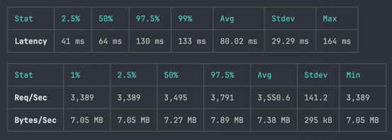

# Benchmark

## With autocannon

### Deposit

```shell
autocannon -c 1 -d 10 -m POST -b '{"id": 1, "amount": 1}' -H 'Content-Type: application/json' http://localhost:8080/balance/deposit
```


### Batching commands (80k Commands/s)



```shell
autocannon -c 128 -d 10 -m POST -b '{"commands":[{"correlationId":"fd66e9e2-26e4-491a-817b-5c862d96fc72","depositCommand":{"id":1,"amount":10}},{"correlationId":"fd66e9e2-26e4-491a-817b-5c862d96fc72","depositCommand":{"id":1,"amount":11}},{"correlationId":"fd66e9e2-26e4-491a-817b-5c862d96fc72","depositCommand":{"id":1,"amount":12}},{"correlationId":"fd66e9e2-26e4-491a-817b-5c862d96fc72","depositCommand":{"id":1,"amount":13}},{"correlationId":"fd66e9e2-26e4-491a-817b-5c862d96fc72","depositCommand":{"id":1,"amount":15}},{"correlationId":"fd66e9e2-26e4-491a-817b-5c862d96fc72","depositCommand":{"id":1,"amount":15}},{"correlationId":"fd66e9e2-26e4-491a-817b-5c862d96fc72","depositCommand":{"id":1,"amount":16}},{"correlationId":"fd66e9e2-26e4-491a-817b-5c862d96fc72","depositCommand":{"id":1,"amount":17}},{"correlationId":"fd66e9e2-26e4-491a-817b-5c862d96fc72","depositCommand":{"id":1,"amount":18}},{"correlationId":"fd66e9e2-26e4-491a-817b-5c862d96fc72","depositCommand":{"id":1,"amount":19}},{"correlationId":"fd66e9e2-26e4-491a-817b-5c862d96fc72","depositCommand":{"id":1,"amount":20}},{"correlationId":"fd66e9e2-26e4-491a-817b-5c862d96fc72","depositCommand":{"id":1,"amount":10}},{"correlationId":"fd66e9e2-26e4-491a-817b-5c862d96fc72","depositCommand":{"id":1,"amount":11}},{"correlationId":"fd66e9e2-26e4-491a-817b-5c862d96fc72","depositCommand":{"id":1,"amount":12}},{"correlationId":"fd66e9e2-26e4-491a-817b-5c862d96fc72","depositCommand":{"id":1,"amount":13}},{"correlationId":"fd66e9e2-26e4-491a-817b-5c862d96fc72","depositCommand":{"id":1,"amount":15}},{"correlationId":"fd66e9e2-26e4-491a-817b-5c862d96fc72","depositCommand":{"id":1,"amount":15}},{"correlationId":"fd66e9e2-26e4-491a-817b-5c862d96fc72","depositCommand":{"id":1,"amount":16}},{"correlationId":"fd66e9e2-26e4-491a-817b-5c862d96fc72","depositCommand":{"id":1,"amount":17}},{"correlationId":"fd66e9e2-26e4-491a-817b-5c862d96fc72","depositCommand":{"id":1,"amount":18}},{"correlationId":"fd66e9e2-26e4-491a-817b-5c862d96fc72","depositCommand":{"id":1,"amount":19}},{"correlationId":"fd66e9e2-26e4-491a-817b-5c862d96fc72","depositCommand":{"id":1,"amount":20}}]}' -H 'Content-Type: application/json' http://localhost:8081/balance/batch
```

Request with a batch size of 40 commands, the system processes more than `2,000` requests per second, resulting in a throughput of `80,000` commands per second.

## With wrk

```shell
wrk -t16 -c32 -d10s -s benchmark/deposit.lua http://localhost:8080/balance/deposit
```
