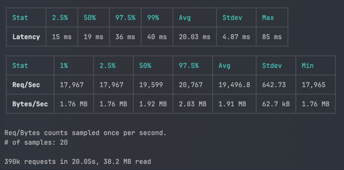

# Benchmark

## With autocannon

```shell
autocannon -c 128 -d 10 -m POST -b '{"id": 1, "amount": 1}' -H 'Content-Type: application/json' http://localhost:8080/balance/deposit
```



## With wrk

```shell
wrk -t16 -c32 -d10s -s benchmark/deposit.lua http://localhost:8080/balance/deposit
```
