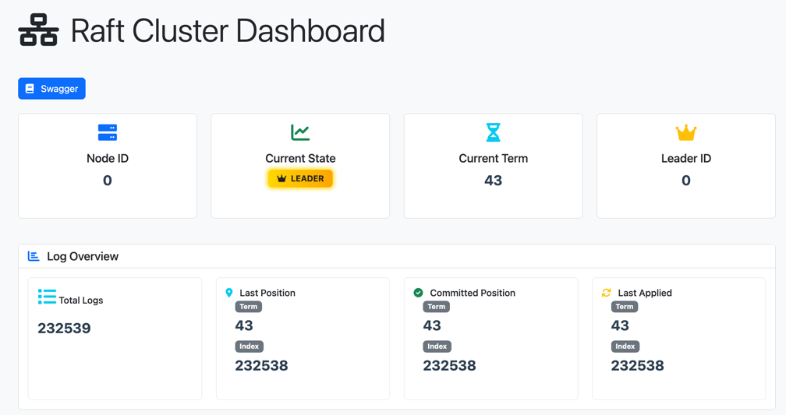
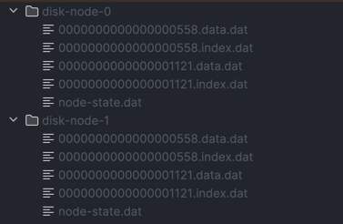
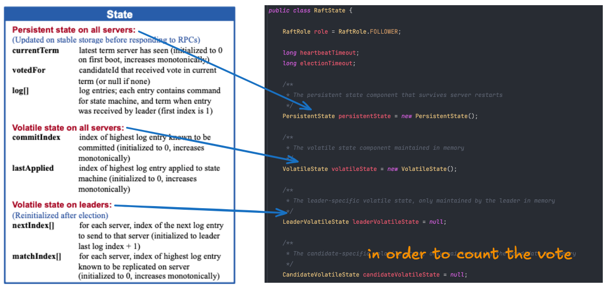
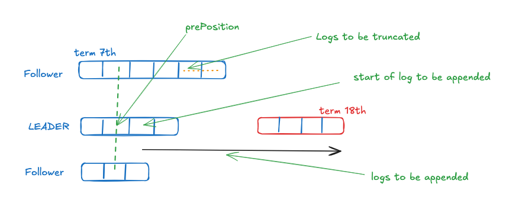
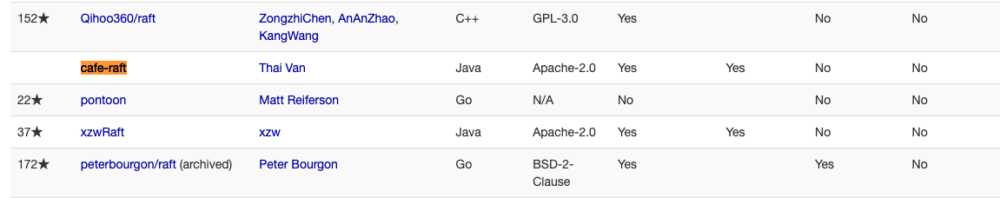

# Cafe Raft

`Cafe Raft` is a Java implementation of the Raft consensus algorithm, providing a distributed,
fault-tolerant system for managing replicated commands.
It follows the Raft consensus protocol as described in the [Raft paper](https://raft.github.io/raft.pdf).

## Development

Run at least 2 nodes:

```shell
./gradlew :raft-application-spring:bootRun --args='--cluster.properties.nodeId=0 --server.port=8080'
./gradlew :raft-application-spring:bootRun --args='--cluster.properties.nodeId=1 --server.port=8081'
./gradlew :raft-application-spring:bootRun --args='--cluster.properties.nodeId=2 --server.port=8082'
```

Or with `docker compose`:

```shell
# in application folder (ex: raft-application-spring)
docker build -t thaivan/cafe-raft:latest -f spring.Dockerfile .
docker compose -f spring.compose.yaml up -d
```

Or with `k8s`

```shell
cd k8s
kubectl apply -f .
```

### UDP supported

Run at least 2 nodes:

```shell
./gradlew :raft-application-spring:bootRun --args='--cluster.properties.nodeId=0 --server.port=8080 --spring.profiles.active=rpc-udp'
./gradlew :raft-application-spring:bootRun --args='--cluster.properties.nodeId=1 --server.port=8081 --spring.profiles.active=rpc-udp'
./gradlew :raft-application-spring:bootRun --args='--cluster.properties.nodeId=2 --server.port=8082 --spring.profiles.active=rpc-udp'
```

Or with docker compose:

```
docker build -t thaivan/cafe-raft:latest -f spring.Dockerfile .
docker compose -f spring.compose.udp.yaml up -d
```

NOTE: When using UDP transport, be aware of the following limitations:

- Maximum UDP datagram size (typically 65,507 bytes) restricts message size
- Configuration parameters `messageBatchSize` and `appendLogBatchSize` should be kept small to avoid fragmentation

### Native execution

```shell
./gradlew :raft-application-spring:nativeCompile

raft-application-spring/build/native/nativeCompile/raft-application-spring --cluster.properties.nodeId=0 --server.port=8080 --cluster.properties.appendLogBatchSize=200
raft-application-spring/build/native/nativeCompile/raft-application-spring --cluster.properties.nodeId=1 --server.port=8081 --cluster.properties.appendLogBatchSize=200
raft-application-spring/build/native/nativeCompile/raft-application-spring --cluster.properties.nodeId=2 --server.port=8082 --cluster.properties.appendLogBatchSize=200
```

### Dashboard



## *Feature*s

| Leader Election + Log Replication | Persistence | Membership Changes | Log Compaction |
|:---------------------------------:|:-----------:|:------------------:|:--------------:|
|                Yes                |     Yes     |         No         |       No       |

## Project structure and Raft paper mapping

### Project structures

- [X] `raft-core`: Core Raft consensus implementation based on the Raft paper, providing leader election, log
  replication, and persistence.
- [X] `application`: Example application demonstrating Raft usage.
    - [X] `raft-application-spring`: Example using spring boot
    - [ ] `raft-application-quarkus`: Example using quarkus

#### Log storage



### Raft paper mapping





Note: the `term` and `index` will be composed to be `position`

## My contribution


